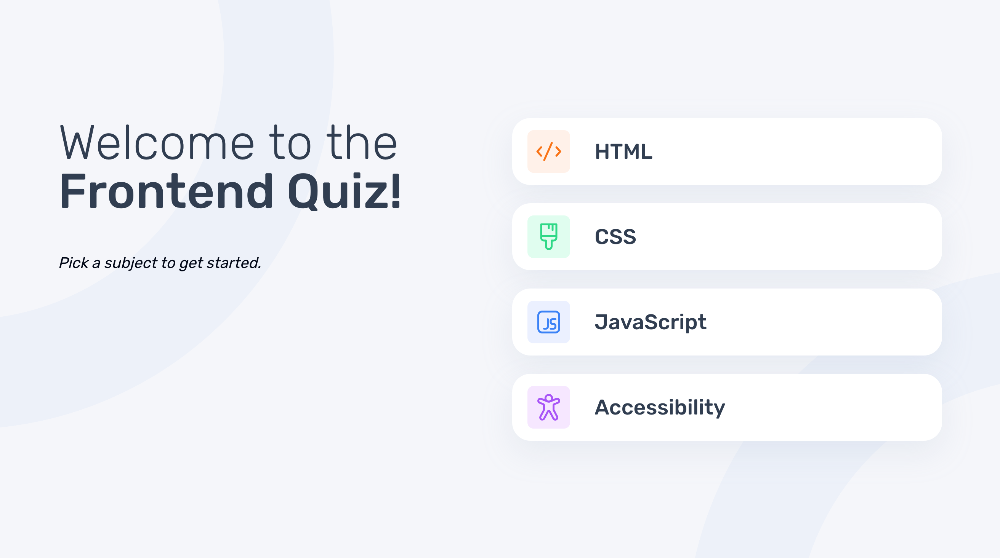

# Frontend Mentor - Password generator app solution

This is a solution to the [Password generator app challenge on Frontend Mentor](https://www.frontendmentor.io/challenges/password-generator-app-Mr8CLycqjh). Frontend Mentor challenges help you improve your coding skills by building realistic projects.

## Table of contents

- [Overview](#overview)
  - [Screenshot](#screenshot)
  - [Links](#links)
- [My process](#my-process)
  - [Built with](#built-with)
  - [What I learned](#what-i-learned)
  - [Useful resources](#useful-resources)
- [Author](#author)
- [Acknowledgments](#acknowledgments)

## Overview

### Screenshot

### Links

- [Live Site URL](https://quiz-4olw28k41-robert-crockers-projects.vercel.app/)

## My process

### Built with

- [Vite](https://vitejs.dev/)
- [Tailwind](https://tailwindcss.com/)
- [TypeScript](https://www.typescriptlang.org/)
- [React](https://reactjs.org/)

### What I learned

This challenge allow me to use a handy hook from the copy functionality from react.gg. I continued using shadcn. I also used the most helpful `group` class from Tailwind to style nested elements without setting state.

### Useful resources

- [Button Group](https://github.com/shadcn-ui/ui/issues/1006) - Amazing button group example.
- [SVG to JSX](https://svg2jsx.com/)

## Author

- Website - [Robert Crocker](https://www.robcrock.com)
- Frontend Mentor - [@robcrock](https://www.frontendmentor.io/profile/robcrock)
- Twitter - [@robcrock](https://twitter.com/robcrock)
- LinkedIn - [@robercrocker](https://www.linkedin.com/in/robertcrocker/)
